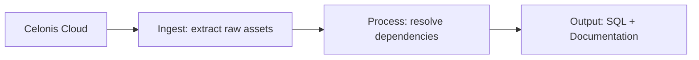

# Celonis to SQL Code Migration Tool

## Overview
Moving business logic out of Celonis can be a daunting task. This tool is designed to **automatically extract** your Celonis assets (KPIs, Filters, Transformations, and Data Models) and **translate** them into standard SQL and plain English documentation.

Whether you're migrating to a new data warehouse or just need to document your complex PQL formulas, this tool does the heavy lifting for you.

---

## How It Works (The "Big Picture")

The tool follows a simple three-step process:



1.  **Extract**: Connects to your Celonis instance and pulls raw JSON data for KPIs, SQL transformations, and Data Model metadata.
2.  **Resolve**: Identifies KPIs that reference other KPIs (the `KPI("...")` syntax) and expands them so the final logic is complete.
3.  **Translate**: Uses AI (Groq LLM) to convert Celonis-specific PQL into standard SQL and writes a "Business English" description for each item.

---

## Project Roadmap (Where everything lives)

-   **`main_ingest.py`**: The "Command Center". Run this to start extracting data.
-   **`src/ingestion/`**: The "Hands". This code talks directly to Celonis.
    -   `connectors.py`: Manages your login and connection.
    -   `extractor.py`: The logic that knows *how* to pull KPIs vs. Transformations.
    -   `models.py`: Defines the "shape" of our data so everything stays organized.
-   **`src/translation/`**: The "Brain".
    -   `kpi_agent.py`: Uses AI to translate PQL to SQL and write descriptions.
-   **`data/`**: The "Storage".
    -   `raw/`: Where your original Celonis data is saved.
    -   `processed/`: Where your final SQL and documentation files end up.

---

## Getting Started

### 1. Requirements
- Python 3.9 or higher.
- API Keys for **Celonis** and **Groq**.

### 2. Setup
1.  **Install dependencies**:
    ```bash
    pip install -r requirements.txt
    ```
2.  **Configure your environment**: Create a `.env` file in the root directory:
    ```env
    CELONIS_URL=https://your-team.celonis.cloud
    CELONIS_API_TOKEN=your_celonis_token
    GROQ_API_KEY=your_groq_ai_token
    
    # Optional: targeted extraction
    SPACE_ID=...
    PACKAGE_ID=...
    KNOWLEDGE_MODEL_ID=...
    ```

### 3. Usage Commands

| Target | Command | Result |
| :--- | :--- | :--- |
| **Standard Run** | `python main_ingest.py` | Extracts KPIs & Transformations |
| **Full Extract** | `python main_ingest.py --all` | Extracts everything (including Data Models) |
| **KPIs Only** | `python main_ingest.py --kpis-only` | Just the Knowledge Model assets |
| **Translate** | `python src/translation/kpi_agent.py` | AI translation of extracted KPIs |

---

## Simple Explanations of Key Components

### The Ingestion Layer (`src/ingestion`)
Think of this as a structured scraper. It doesn't just "copy/paste" from Celonis; it validates every piece of data. 
- If a KPI depends on three other KPIs, the **Extractor** marks those dependencies.
- If a Transformation uses specific SAP tables, the **Extractor** finds them using smart regex patterns.

### The Translation Brain (`src/translation/kpi_agent.py`)
This is where the magic happens. We send the raw JSON to a Large Language Model (LLM) with a very specific "System Prompt". The AI isn't just guessing; it's acting as a Senior Data Engineer to:
1.  **Flatten Logic**: Turn `KPI("Revenue") / KPI("Volume")` into the actual underlying SQL math.
2.  **Standardize**: Change PQL functions (like `FILTER_TO_NULL`) into standard SQL `CASE WHEN` logic.
3.  **Explain**: Write a sentence like *"This KPI calculates the average net value of sales orders, excluding cancelled items."*

---

## Example Output
When you run the translation agent, you'll get a file in `data/processed/translated_kpis.json` that looks like this:

```json
{
  "kpi_id": "avg_net_value",
  "name": "Average Net Value",
  "final_sql": "AVG(CASE WHEN \"VBAP\".\"ABGRU\" IS NULL THEN \"VBAP\".\"NETWR\" ELSE 0 END)",
  "english_description": "Calculates the average net value of line items that have not been rejected."
}
```

---

## Built With
- **[PyCelonis](https://github.com/celonis/pycelonis)**: For reliable API communication.
- **[Pydantic](https://docs.pydantic.dev/)**: To ensure our data never breaks.
- **[LangChain](https://www.langchain.com/)**: To power our AI translation engine.
- **[Groq](https://groq.com/)**: For lightning-fast AI processing.
